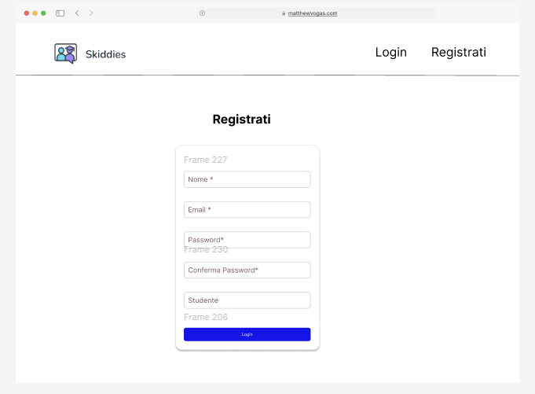
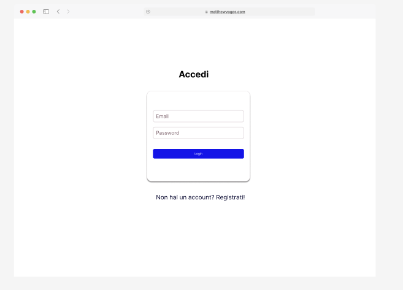
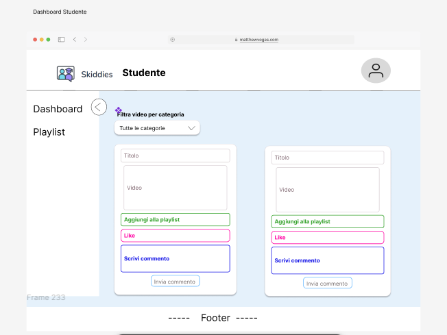
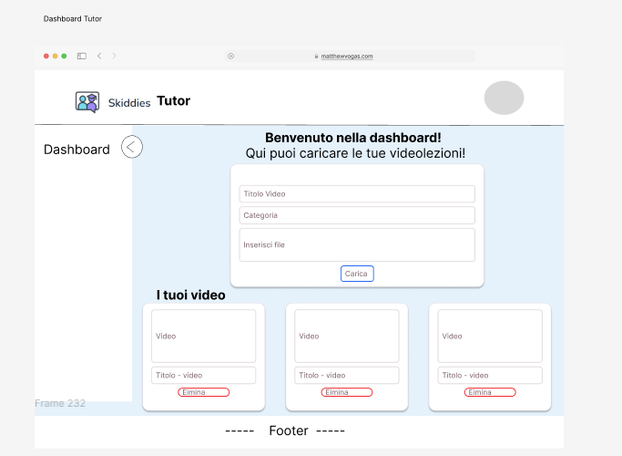
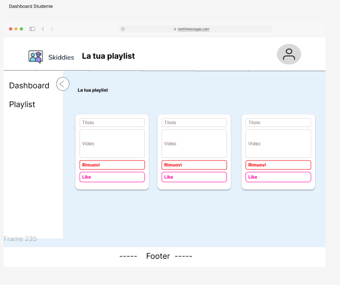

# 🎓 Skiddies – Piattaforma E-Learning Web

Skiddies è una piattaforma di e-learning che consente a **Studenti** e **Tutor** di interagire con contenuti video didattici, gestire playlist, e personalizzare la propria esperienza di studio in modo dinamico.

---
## 🎨 UI Design (Figma)
- L’interfaccia utente è stata progettata in Figma per definire la user experience prima dello sviluppo frontend.

- https://www.figma.com/design/dQrHcq4Xzw7mIDJINDUroR/Untitled?node-id=0-1&t=elRYdzRqtyrmRvrT-1

- Registrazione e autenticazione





- Dashboard studente



- Dashboard tutor



- Aggiungi e cancella video alla playlist




##  Funzionalità principali

### 👨‍🎓 Studente
- Registrazione e autenticazione
- Dashboard studente
- Aggiungi e cancella video alla playlist
- Visione video-lezioni caricate da diversi tutor sulla pagina
- Lasciare like, commenti
- Modifica dati e immagine del profilo

### 👩‍🏫 Tutor
- Registrazione e autenticazione
- Caricamento video sulla piattaforma 
- Cancella video dalla piattaforma
- Visualizzazione dei propri video caricati
- Visualizzazione dei commenti, likes lasciati dagli studenti
- Modifica dati e immagine del profilo 
---

## 🛠️ Tecnologie utilizzate

### Backend
| Tecnologia          | Scopo                                           |
|---------------------|--------------------------------------------------|
| PHP                 | API REST, gestione sessioni e autenticazione     |
| MySQL/MariaDB       | Database relazionale                             |
| bcrypt (PHP)        | Hashing sicuro delle password                    |
| Node.js + Express   | Servizio extra per autenticazione (non usato con JWT) |
| PHP Sessions        | Gestione stato utente tramite PHPSESSID         |

### Frontend
| Tecnologia          | Scopo                                           |
|---------------------|--------------------------------------------------|
| Vue.js 3            | SPA reattiva                                     |
| Vite                | Tool di build e sviluppo                         |
| Vue Router          | Routing lato client                              |
| Axios / Fetch API   | Comunicazione asincrona con backend              |
| Tailwind CSS        | Styling responsive tramite utility classes       |
| PostCSS / Autoprefixer | Compatibilità cross-browser                   |

---

## 🧱 Architettura

- Il frontend (Vue 3) comunica con il backend PHP tramite API REST.
- Le sessioni sono gestite con PHPSESSID (nessun JWT).
- Nel database MySQL: tabelle users(Studenti), tutor(tutor), video, playlist, likes e comments.
- L'autenticazione è basata sugli attributi 'role' presenti in entrambe le tabelle   (Studente/Tutor).
- Tutta la comunicazione frontend-backend avviene via **chiamate AJAX** (Axios o Fetch).

---

## 🔐 Autenticazione & Sicurezza

-  Autenticazione con sessione PHP (`$_SESSION` + `PHPSESSID`)
-  Password salvate in modo sicuro con `password_hash()` (bcrypt)
-  Verifica credenziali con `password_verify()`
-  Sanificazione del nome file al caricamento video:

$safeName = preg_replace("/[^a-zA-Z0-9\.\-_]/", "", basename($videoFile['name']));
$filename = uniqid() . '_' . $safeName;

---

## 🧪 Istruzioni per avviare il progetto

- Aprire un terminale nella cartella XAMPP/htdocs e
- scaricare il progetto da github
- git clone https://github.com/TDianaAle/Skiddies.git
- in http://localhost/phpmyadmin Creare un nuovo database, skiddies_db, incollando il contenut del file /backend/database/skiddies_db.sql
- avviare mysql e apache su xampp
- spostarsi nella cartella root del progetto(Skiddies)e installare le librerie con
''' npm install
    cd frontend 
    npm run dev'''

⚠️ Ogni modifica al database richiede l'esportazione del file .sql aggiornato per essere versionato correttamente su GitHub.

⚠️ **Per caricare video superiori a 2MB, aggiungi nella cartella `.htaccess` le seguenti righe:**

```apache
php_value upload_max_filesize 10M
php_value post_max_size 10M
php_value max_input_time 300
php_value max_execution_time 300


